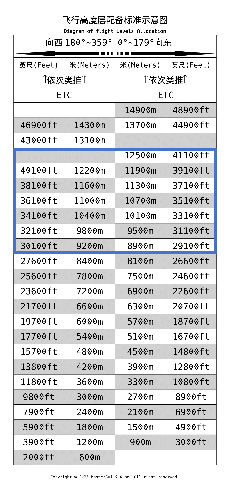
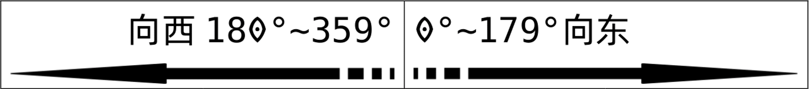

# RVSM 飞行高度层

RVSM Metric Flight Level

## 历史背景

在 1958 年，在管制空域内的标准飞航垂直间隔距离以空层 FL290 为分界。

从海平面或地平面到 FL290 之间的垂直间格距离为 1000 英尺，超过 FL290 的空域要求垂直间隔距离为 2000 英尺。

之所以有必要在更高的空预留更大的间隔，是因为当时使用的高度计依照气压变化判断高度，并不够准确。

为了减少在 FL290 以上的垂直间隔距离，需要航空器配备有更高先进的高度计或其他配备，以利航空器明确地知道自己所在的高度，并维持希望的高度。

只有精确的高度，才能维持相同空域内各航空器之间的实际垂直间隔。

直到 1990 年代发展出来的大气数据计算机和高度计以及自动驾驶系统，才有足够的条件让垂直间隔距离缩小。

## RVSM 飞行高度层示意图

## RVSM 空域

在8900-12500米（29100-41100ft）的平飞巡航区间，两个飞行高度层之间的垂直标准由600米（2000ft）缩小为300米（1000ft）。

此举使得高度区间的飞行层数由7层增加至13层。引入RVSM运行相当于提高了航路的带宽。

在RVSM 空域中的所有航空器必须遵守“东单西双”原则，即为： 

向东飞行（0°~179°）的航空器使用单数飞行高度层飞行，向西飞行（180°~359°）的航空器使用单数飞行高度层飞行。

## RVSM 定义

RVSM：

即，缩小最低垂直间隔Reduced Vertical Separation Minimum

国际上对于RVSM的定义是指：

在实行RVSM运行的空域内（RVSM空域），在FL290至FL410（包含这两个高度层）之间的垂直间隔标准由2000ft缩小到1000ft。

按照这样的标准从事的飞行活动称之为RVSM飞行。

## 航空器驾驶员要求

在RVSM空域内运行的航空器，需具备RVSM空域运行能力。

在高度层转换时，航空器偏离指定的飞行高度层的最大误差不得超过45米（150英尺）。

应当强调当飞机通过转换高度时，要迅速在所有主用和备用高度表的小刻度窗设置29.92英寸汞柱/1013.2百帕，并在到达初始许可飞行高度层（CFL）时应再次检查高度表设置是否正确。

## 转换空域

从非RVSM空域到RVSM空域之间的转换空域，即从2000英尺垂直间隔的标准垂直间隔空域过渡到1000英尺垂直间隔的RVSM空域，或者离开1000英尺垂直间隔的RVSM空域，进入到2000英尺垂直间隔的区域，称作RVSM转换区域。

特殊情况：

有时由于天气条件和交通情况的综合原因，在当地区域空中交通管制（ATC）宣布暂时停止RVSM运行那一时刻，保持飞机的垂直间隔由原来的1000英尺扩大到2000英尺；或者区域航空管制宣布取消暂时停止RVSM运行的禁令那一时刻，飞机从2000英尺垂直间隔变为1000英尺的垂直间隔，同一区域的垂直间隔的转换也称作RVSM转换区域。

## 实施时间

中国于2007年11月22日0时在所属空域8900米至12500米之间实施米制的缩小垂直间隔。

## 参考文献

[1] [CAAC.RVSM空域运行要求](https://www.caac.gov.cn/XXGK/XXGK/GFXWJ/201801/P020180123610461292434.pdf)

[2] [CAAC.缩小垂直间隔（RVSM）空域的运行要求](https://www.caac.gov.cn/XXGK/XXGK/GFXWJ/201511/P020151103346940128611.pdf)

[3] [百度百科.RVSM空域](https://baike.baidu.com/item/RVSM%E7%A9%BA%E5%9F%9F/15731374)

[4] [VARPRC.RVSM飞行高度层分配方案](https://www.vatprc.net/zh-cn/airspace/rvsm)
