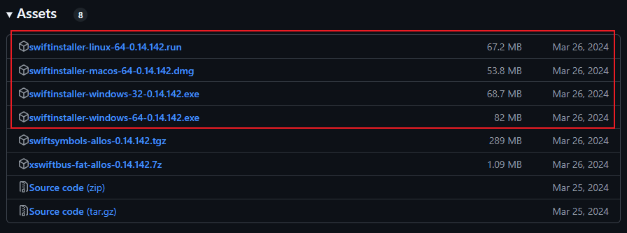
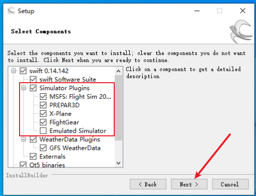
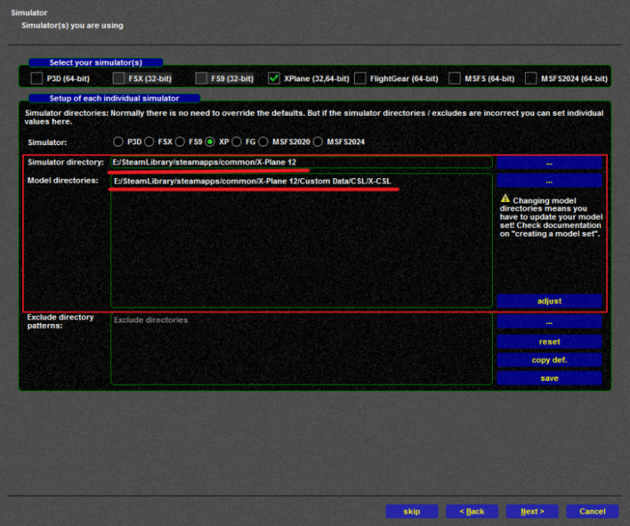

# 连线飞行教程 

Connected Flight Tutorial

## 前言

本文档旨在为您提供一份清晰、详实的操作指南无论您是首次接触联飞，还是希望在一个规范化的新平台开始您的联飞之旅，本指南都将一步步引导您完成从软件准备、客户端配置、服务器连接到实际飞行操作的全过程我们涵盖了主流模拟飞行软件（如 Flight Simulator X、Prepar 3D、X-Plane、Microsoft Flight Simulator）的联飞设置要点，并重点强调了联飞中的规范、礼仪与安全准则

我们坚信，遵循指引、熟悉流程、尊重规则，是保障您个人及其他参与者获得流畅、沉浸且富有成就感联飞体验的基础特别是对于新手飞行员，我们强烈建议您在参与联飞活动前，务必熟练掌握所选机型的操作，并认真阅读本指南

现在，请跟随本指南，开启您的联飞旅程，我们期待在虚拟的蓝天之上，与您安全、顺畅地相会！

## 修订记录

| 版本 | 时间       | 编者      | 描述                   |
| ---- | ---------- | --------- | ---------------------- |
| 0.1  | 2025.05.31 | 2352      | 第一版                 |
| 1.0  | 2025.6.1   | 2352&5516 | 修改排版、增加部分内容 |

## 第一章 连飞软件的安装及配置

### 1. 下载所需文件

#### 1.1 Swift客户端

首先，需要下载swift联飞客户端，任意版本均可，[Swift Github仓库官方下载地址](https://github.com/swift-project/pilotclient/releases)：

请尽可能避免使用Alpha版本，除非您清晰明确的知晓使用Alpha版本可能导致的后果，如下图所示（图片截于2025.05.29）

!!! Note

    请不要使用Alpha开头的版本
    
    请使用以Beta或者只有Version开头且后方标记为latest的版本

然后根据您的操作系统情况，点击“Assets”下方特定版本的安装包下载

若您不清楚windows-32与windows-64的区别，请善用搜索引擎

目前大部分操作系统都是64位的，即选择"64"字样的安装包即可

特别如果您是X-Plane 11/12用户，还需要下载xswiftbus，后文将再次提到

请确保xswiftbus的版本号，即0.14.142，与您下载的swift版本号相匹配

请注意：

| 名称      | 类型 | 安装位置                             |
| --------- | ---- | ------------------------------------ |
| Swift     | 软件 | 任意位置  （就像日常安装的软件一样） |
| xswiftbus | 插件 | X-Plane的插件文件夹                  |

#### 1.2 下载机模映射包

关于映射包的作用：

机模映射包对于完整的连飞体验来说是必需且必要的，虽然不同模拟飞行软件的机模映射包各不相同，但对于连飞而言，其底层逻辑逻辑是一致的，即：

1. 使模拟飞行软件和swift 可以读取几乎所有主流机型的“飞机模型”（即“机模”）；
2. 在游戏内添加“AI”飞机；
3. 根据从连飞服务器上其他飞机的状态，同步调整“AI”飞机的状态

由此实现了将服务器上的其他飞机 “映射” 到您自己的模拟飞行软件中

所以“机模”由映射包提供，“映射”则由联飞软件提供

##### 1.2.1 MSFS 2020映射

[swift官方关于MSFS机模映射的文档](https://swift-project.org/home/models/msfs/)

推荐使用AIG映射包

AIG映射包下载后需要手动解压到MSFS的community目录下，注意不要出现文件夹嵌套

由于编者并不是MSFS玩家，所以暂时没有下载链接 : (

##### 1.2.2 X-Plane 11/12 映射

[swift官方关于X-Plane机模映射的文档](https://swift-project.org/home/models/xplane/)

您可以使用官方文档中提到的X-CSL作为X-Plane的映射包，这里是X-CSL的官网：https://x-csl.ru/downloads

按照X-CSL官网提供的步骤进行下载安装即可

鉴于X-CSL的官方下载器的下载速度感人，这里给出网盘下载地址

百度网盘：https://pan.baidu.com/s/1FdbYVhd8lucimYaXXuTmMw?pwd=hkps

123云盘：[https://www.123912.com/s/oFMGTd-Rs4gv?](https://www.123912.com/s/oFMGTd-Rs4gv?)   提取码:tZgp

下载后请解压到xplane目录的任意位置，推荐放在Custom Data文件夹下，文件名随意，但一定要在xplane的目录下，xplane无法读取目录以外的文件

##### 1.2.3 Flight Simulator X & Prepar 3D

[swift官方关于Flight Simulator X、Prepar 3D机模映射的文档](https://swift-project.org/home/models/fsx_p3d/)

官方文档也没写太多东西，只提了一嘴P3D用的是AIG映射包

### 2. 安装Swift

在安装之前，请确认四件事情：

- swift安装包和对应的映射文件已经下载完毕
- 对于X-Plane 11/12的用户：xswiftbus已正确安装并加载
- 关闭所有正在运行的swift和模拟器
- 确保使用的是正确的swift32或swift64位版本

本小节以windows10 64位为例，其他操作系统大同小异

本教程假设您为第一次安装swift，如果您曾经安装过swift，则部分页面会有些许不同，请您灵活应变

1.  双击运行swift安装程序，你可能会看到如下窗口：

|  |  |
| ------------------------------------------------------------ | ------------------------------------------------------------ |
| 2. 点击“是”即可                                              | 3. 点击“Next”                                                |
|  |  |
| 4. 点击“I accept the agreement”，然后下一步                  | 红框内请按照你安装的模拟器勾选，  然后下一步  **注：除了红框内的内容，**  **不要动其他的选项** |
|  |  |
| 5. 在这个页面可以自定义安装目录，建议放置在自己记得的位置  **注：其他选项不要动，下一步** | 6. 点击Next                                                  |
|  |  |
| 7. 等待安装完成后，点击下一步                                | 8. 随后会弹出如下页面                                        |

9. 请等待他初始化完成，初始化完成后会跳出如下页面：

   

10. 此时我们的swift已经安装好了，接下来要进行swift的配置

### 3 Swift配置（模型库安装）

#### 3.1 同意使用协议

勾上这两个复选框，前者表示同意使用协议，后者表示向服务器发送崩溃报告。

#### 3.2 检查数据库

在此页面您也许需要等待一些时间，来让Swift下载运行所必须的数据，当“Next”按钮亮起的时候，代表您可以继续进行下一步了，后续Swift可能会在后台继续下载一些数据。

#### 3.3 从其他版本复制模型库

如果您曾经安装过其他Swift版本，可以在此页面从其他Swift中复制模型库。

如果您是第一次安装Swift或者不需要其他版本的模型库，则可以直接进行下一步。

#### 3.4 从其他版本复制配置文件

#### 3.5 路径配置

|  |  |
| ------------------------------------------------------------ | ------------------------------------------------------------ |
| 对于上方的模拟器，您飞哪个，就勾选哪个  请不要多勾选，后续您需要对每个模拟器进行模型库配置  这里我们以X-Plane为例（其他模拟器操作类似） | 首先，需要检查模拟器路径（第一行）和模型库路径（第二行）是否正确，  如果swift没有正确识别，需要点击对应的右侧按钮，手动选择目录 |
|  |                                                              |
| 对于其他模拟器，同理  检查无误后，点击save按钮后，进入下一步  （如果有多个模拟器，请全部检查完成并save后再进入下一步） |                                                              |

#### 3.6 创建模型库

这里同样以X-Plane为例：

首先，需要在左侧选择对应的模拟器平台，在这里我们选择X-Plane  然后，注意力来到右侧的models选项卡  第一行，是模型库路径，这里再次检查一下是否正确  然后，点击第二行的display按钮，会弹出如下窗口：

  

我们点击force reload，耐心等等他重新加载完。

#### 3.7 X-CSL映射

如果您是用的X-CSL官方的下载器下载的，那么会显示报错。

此时我们关掉该报错窗口，然后在任意一个模型上右键：

->simulator

->Xplane:run CSL2XSB on all models 

此时会打开一个黑窗口。

我们键入y并且回车，等他输出完成后，关掉该窗口。

我们重新force reload一遍。

若一切正常，则您可以看到如上窗口

此时我们关闭最上面的两个窗口，点击create按钮

对于第一个跳出来的窗口，选择Yes

---

未完待续

---

## 后记

(有意留空)